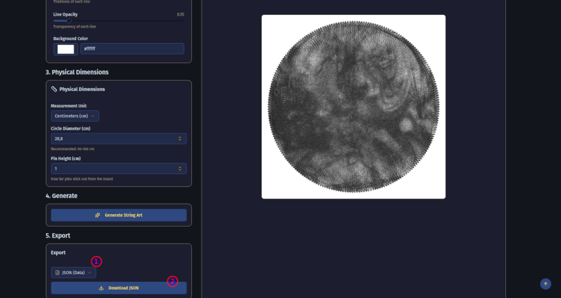
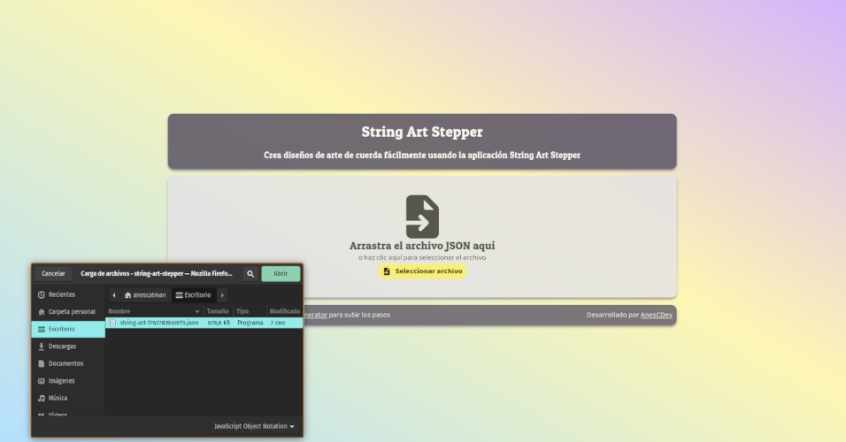

# String Art Stepper
A graphical asistent for follow the steps provides by the [String art generator](https://www.stringartgenerator.app) app.
Provide a friendly UI to create beautiful string art.

## How to use
1. First you have to generate the JSON file with all the necesary data, with [String art generator](https://www.stringartgenerator.app).
2. Then, upload the JSON file in the application to parse de data and prepare the assistant.
3. Start following the steps with the buttons or the arrow keys!

## Libraries used 
 - React for UI
 - FontAwesome for React
 - Vitest to testing
